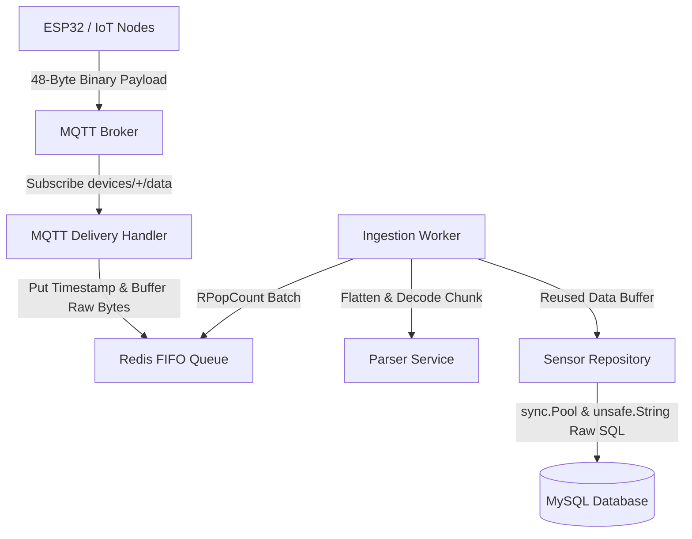

# Dokumentasi Arsitektur: Backend IoT Environmental Data Logger

## Gambaran Umum

Proyek ini adalah sistem backend berkinerja sangat tinggi dan teroptimasi secara memori yang ditulis menggunakan Go (Golang) untuk pencatatan data lingkungan dari perangkat IoT. Sistem ini dirancang khusus untuk menyerap, mengurai, menyangga, dan menyimpan metrik lingkungan (seperti suhu dan kelembapan) dari mikrokontroler (seperti ESP32) dengan **nol alokasi heap (0 allocs/op)** selama proses *batch ingestion*.

## Aliran Data (Data Flow)

Berikut adalah visualisasi aliran data dari hulu (Perangkat IoT) ke hilir (Penyimpanan MySQL):

---

## Rincian Arsitektur Sistem

### 1. Lapisan Hulu / Upstream (IoT Edge)

* Mikrokontroler secara berkelanjutan melakukan pengukuran suhu dan kelembapan.

* Untuk meminimalisir *overhead* dan penggunaan *bandwidth*, data telemetri tidak dikirim dalam format JSON, melainkan dikemas menjadi **struktur biner 48-byte** yang sangat padat:

* 
**4 byte**: Epoch Timestamp (Little Endian).

* 
**1 byte**: Node ID.

* 
**3 byte**: Padding (ditambahkan secara eksplisit untuk menjaga *memory alignment* pada batas 16-bit).

* 
**40 byte**: 10 log data sensor yang berurutan (Setiap log berukuran `4` byte: `int16` untuk Kelembapan, `int16` untuk Suhu).

* Paket biner ini kemudian dipublikasikan melalui protokol MQTT ke topik dengan format `devices/{MAC_ADDRESS}/data`.

### 2. Lapisan Ingestion (MQTT Handler)

* 
**Registrasi Perangkat**: Saat perangkat dinyalakan, perangkat akan memublikasikan *MAC Address*-nya ke topik `devices/register`. Handler MQTT menggunakan penguncian pesimis (*pessimistic locking* dengan `FOR UPDATE`) pada MySQL melalui `DeviceRepository` untuk menetapkan `Node ID` sekuensial 8-bit yang unik (mendukung hingga 255 perangkat secara aman).

* 
**Penerimaan Telemetri**: Ketika *payload* biner tiba, `HandleSensorData` memvalidasi ukuran paket (wajib 48 byte). Untuk menghindari alokasi *heap*, sistem menggunakan `binary.LittleEndian.PutUint32` untuk menimpa 4 byte pertama dari *payload* tersebut dengan stempel waktu UNIX dari server saat itu juga, lalu langsung meneruskan *byte* mentah tersebut ke tahap selanjutnya.

### 3. Lapisan Middleware Buffer (Redis FIFO)

* Permintaan tulis MQTT berfrekuensi tinggi dapat membebani batas penulisan basis data secara langsung.

* Untuk memisahkan proses penerimaan dari operasi penulisan basis data, *payload* biner 48-byte mentah tersebut didorong (di- *push*) ke dalam **Redis List FIFO Buffer** (pada kunci `queue:sensor_ingestion`) menggunakan perintah `LPush`.

* Dengan meneruskan *payload* biner secara langsung, sistem berhasil melewati proses serialisasi/deserialisasi JSON yang mahal pada *thread* utama, sehingga menjaga alokasi memori tetap mutlak di angka **nol**.

### 4. Lapisan Pemrosesan (Ingestion Worker & Parser)

* Sebuah `IngestionWorker` berjalan secara independen di latar belakang. Setiap 5 detik, worker ini menguras antrean (*draining batches*) hingga 100 paket sekaligus menggunakan perintah Redis `RPopCount` hanya dalam satu kali putaran jaringan (*network roundtrip*).

* 
**Konversi 0-Allocation**: Nilai *string* mentah yang ditarik dari Redis diubah menjadi *byte slice* secara *in-place* menggunakan paket `unsafe` bawaan Go.

* 
**Parsing**: `ParserService` membaca format biner Little Endian dan mendekodenya langsung ke dalam struktur `ChunkPayload` yang dialokasikan di *stack* memori.

* 
**Flattening**: Worker memperluas (*flattening*) 10 titik data yang terkonsolidasi dalam satu *chunk* menjadi 10 entri baris `SensorDataRow` individual. Worker menghitung stempel waktu presisi untuk setiap titik log (misalnya, dengan melangkah mundur 2 detik untuk setiap log historis yang berurutan). Baris-baris ini digabungkan (*appended*) ke dalam *slice buffer* persisten internal (`dbRowsBuf`) milik worker tersebut guna menghindari proses pengubahan ukuran (*resizing*) memori (*array*) saat *runtime*.

### 5. Lapisan Hilir / Downstream (Penyimpanan MySQL)

Untuk menyimpan secara persisten *batch* `SensorDataRow` ke **MySQL** tanpa menimbulkan *overhead* memori, sistem menerapkan 3 langkah berikut:

1. 
**Thread-Safe Memory Recycling**: `SensorRepository` mengambil *buffer* ruang tulis dari sebuah mekanisme `sync.Pool`.

2. 
**Allocation-Free Formatting**: Repositori memformat nilai data langsung ke atas *byte buffer* menggunakan primitif formating tingkat rendah bawaan Go (seperti `time.AppendFormat`, `strconv.AppendUint`, dan `strconv.AppendFloat`).

3. 
**Zero-Copy Query Transmission**: Rangkaian kueri SQL akhir yang berhasil dibentuk (misal: `INSERT INTO sensor_logs ...`) secara paksa di-*cast* menjadi bentuk *string* melalui fungsi `unsafe.String` dan diteruskan ke *driver* SQL, sehingga mengeksekusi penulisan *batch* berkecepatan tinggi dengan **nol alokasi heap**.

Basis data MySQL menyimpan log historis final ini dengan indeks optimal pada kolom `time` dan `node_id` untuk kebutuhan dasbor analitik dan pengambilan kueri (*querying*) dari *end-user* di kemudian hari.