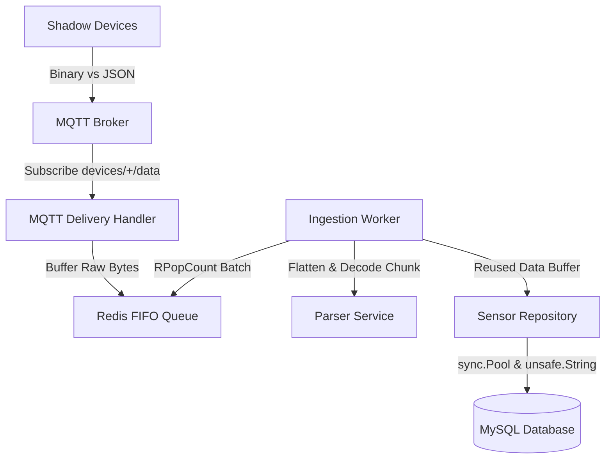

# Overview: Paket Tolok Ukur Kinerja (Benchmarking & Stress-Testing Suite)

Dokumentasi ini menjelaskan arsitektur, parameter, dan panduan untuk menjalankan paket pengujian performa (*benchmarking*) dan *stress-testing* ilmiah yang dirancang khusus untuk menganalisis infrastruktur backend penyerapan (*ingestion*) data lingkungan IoT.

## Tujuan Pengujian
Paket pengujian ini tidak ditujukan untuk menguji penyedia komputasi awan (seperti AWS), melainkan untuk **mengumpulkan metrik performa lokal yang akurat dan berulang (*repeatable*)**. Data metrik lokal ini kemudian digunakan sebagai dasar empiris untuk menghitung estimasi biaya operasional AWS (seperti AWS IoT Core Message Billing, write IOPS RDS, dan durasi eksekusi Lambda).

## Alur Pipeline Sistem Nyata
Semua modul pengujian dirancang untuk menguji komponen nyata, tanpa menggunakan tiruan (*mocks*).



---

## Daftar Eksperimen

1. **`benchmark-json-binary`** (Eksperimen 1: JSON vs Binary)
   Mengukur penghematan ukuran paket, kecepatan serialisasi/deserialisasi, dan efisiensi alokasi memori antara payload biner 48-byte teroptimasi dengan format standar JSON (termasuk kompresi Gzip).

2. **`benchmark-chunk`** (Eksperimen 2: Chunk Aggregation)
   Menganalisis bagaimana agregasi log sensor di sisi *edge* (ukuran chunk 1, 10, 30, dan 60) memengaruhi jumlah pesan publikasi MQTT dan total beban *bandwidth*.

3. **`benchmark-db`** (Eksperimen 3: Single INSERT vs Zero-Alloc Batch INSERT)
   Menguji batas kecepatan penyisipan database MySQL pada berbagai ukuran batch (1, 10, 25, 50, 100, 250, 500) guna mencari titik jenuh efisiensi optimal.

4. **`benchmark-redis`** (Eksperimen 4: Redis Buffer vs Direct MySQL Ingestion)
   Mensimulasikan beban letupan (*burst* tumpukan pesan) untuk membuktikan peran Redis FIFO List sebagai penyangga kestabilan (*shock absorber*) untuk meredam lonjakan penulisan langsung ke MySQL.

5. **`stress-shadow-device`** (Eksperimen 5: End-to-End Scalability Stress-Testing)
   Emulasi skala besar hingga 20.000 virtual node menggunakan *Worker Pool* dan *Traffic Scheduler* untuk mencatat P50/P90/P95/P99 latency, laju *throughput*, laju *bandwidth*, akumulasi antrean, dan konsumsi memori runtime.

---

## Panduan Cepat Menjalankan Semua Pengujian
Anda dapat menjalankan seluruh rangkaian pengujian secara otomatis menggunakan satu perintah orkestrator yang akan menyimpan semua hasil (JSON, CSV, Markdown, dan Metadata spesifikasi mesin) ke dalam folder bertimestamp di bawah `results/`:

```bash
cd backend/
go run cmd/run-all/main.go
```
